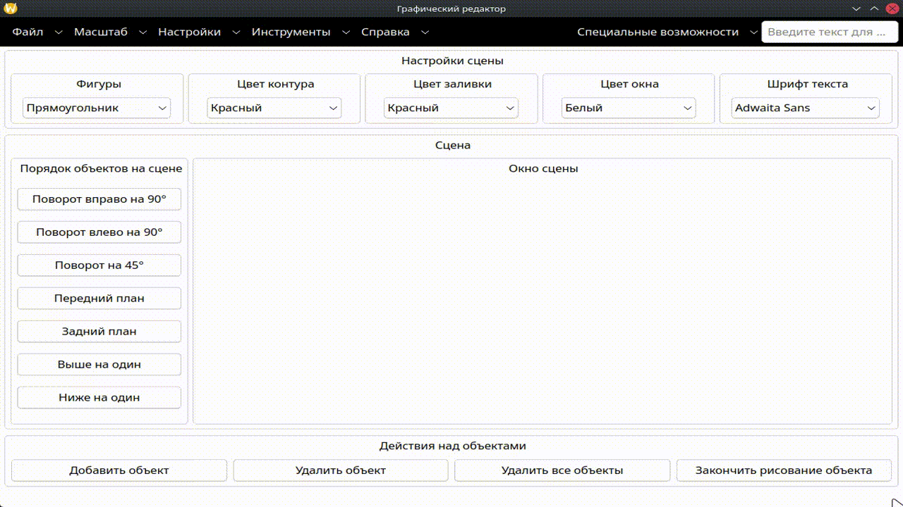

# Системные требования для приложения графического редактора для работы с объектами на сцене.

# 1. Суть проекта

Проект предоставляет кроссплатформенное десктопное приложение для создания и редактирования изображений:

```
1) Специализированные классы для построения основного окна приложения
   с меню, панелью инструментов и панелью поиска действий.

2) Диалоги настройки объектов сцены (цвет контура, заливки, шрифт текста,
   размеры PDF, формат создаваемого файла).

3) Абстракция графической сцены для работы с пользовательскими фигурами,
   текстом, кастомными путями и операциями порядка отображения.
```

# 2. Архитектура проекта

Проект включает специализированные классы для работы с графическим интерфейсом и сценой:

```
1) ApplicationWindow — главное окно приложения, наследник QMainWindow,
   объединяющий меню, панель инструментов, сцену и настройки.

2) CustomShapeItem — графический элемент сцены, поддерживающий различные
   типы фигур (прямоугольник, эллипс, линия, многоугольник, текст,
   пользовательский путь).

3) GridScene — наследник QGraphicsScene с поддержкой отображения сетки
   и настройки её размера.

4) ShapeType - enum-класс для конкретных типов объектов на сцене. 

4) TextObject — диалоговый класс для ввода текста при создании
   текстового объекта на сцене.

5) PdfActionsWindow — диалоговое окно для экспорта и импорта изображений
   в формат PDF с выбором размера страницы.

6) FilesActionsMenu — класс для управления действиями файловой системы
   (создание, открытие, сохранение, экспорт, импорт).

7) InstrumentsMenu — класс для управления инструментами рисования:
   стилями линий, концов, соединений и заливки.

8) ScaleMenu - класс-меню для работы с масштабами текста и сцены. 

9) CollectAllActions — класс для сбора всех действий приложения
   и передачи их в QCompleter для поиска.
```

# 3. Требования к тестируемости и стандарту языка

```
1) Покрытие тестами публичных методов (в разработке).

2) Использование Qt Test для unit-тестирования.

3) Отсутствие прямых обращений к QMessageBox в тестируемых классах —
   сообщения выводятся через QStatusBar.

4) Должен быть минимум С++17 стандарт для работы приложения.

5) Сборка через qmake с поддержкой Qt 6.5+.
```

# 4. Требования к запуску приложения

1) Первоначально можно скачать репозиторий приложения в виде zip-файла или установить через команду git:
```
git clone https://github.com/Frolotey1/GraphicsEditor.git
```

2) Сборка из исходников после клонирования репозитория:
```
cd GraphicsEditor
qmake6 GraphicsEditor.pro
make -j$(nproc)
./GraphicsEditor
```

3) Установка через пакетные менеджеры. Доступны два формата:

```
1) RPM-пакет для Fedora 44:
   sudo dnf install ./GraphicsEditor-1.0-1.fc44.x86_64.rpm

2) DEB-пакет для Debian 13 (trixie):
   sudo dpkg -i ./graphics-editor_1.0-1_amd64.deb
```

4) Если у пользователя отсутствует Qt 6, то есть вариант сборки и запуска приложения через платформу Docker. Для этого нужно иметь установленный Docker на своём персональном компьютере или ноутбуке. Для начала нужно отозвать доступ к X-серверу:
```
xhost -local:docker 
```
Далее уже устанавливать и запускать Docker-контейнер:
```
1) Установка контейнера под приложение: sudo docker build -t graphics-editor .
2) Запуск контейнера: sudo docker run -it graphics-editor
```

5) После успешной сборки пользователь может работать с приложением. Для этого нужно запустить бинарник или установить пакет:

```
GraphicsEditor — запуск из терминала
или из меню приложений («Graphics Editor»)
```

# 5. Пример использования приложения

