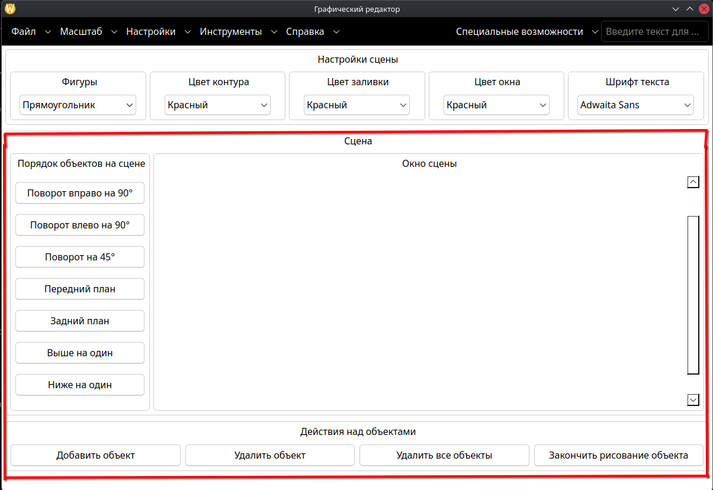

# Графическая сцена

Графическая сцена — это центральная часть приложения **GraphicsEditor**, в которой пользователь размещает, перемещает и редактирует графические объекты. Сцена отображается в окне просмотра и поддерживает работу с векторными фигурами, текстом, пользовательскими путями, а также операции порядка и трансформации объектов.

Сцена состоит из следующих элементов:

- **Окно сцены** - область отображения графических объектов.
- **Порядок объектов на сцене** - панель кнопок для трансформации и изменения порядка объектов.
- **Действия над объектами** - панель кнопок для добавления, удаления и завершения рисования.

Ниже описано, как работает каждая группа кнопок и что именно они делают.

---

## 1. Окно сцены

**Окно сцены** - это область, в которой отображаются все графические объекты. Сцена имеет фиксированный размер (800×500 пикселей по умолчанию), но её можно масштабировать через меню **Масштаб -> Масштаб сцены**.

Возможности в окне сцены:

- **Перемещение объектов** - перетаскиванием выделенного объекта.
- **Поворот объектов** - через панель **Порядок объектов на сцене** (см. раздел 2).
- **Панорамирование сцены** - при включённом режиме **Специальные возможности -> Панорамирование сцены** (перетаскивание сцены мышью).

Сцена поддерживает отображение сетки, которая помогает выравнивать объекты. Включение и настройка сетки доступны в меню **Инструменты -> Сетка**.

---

## 2. Порядок объектов на сцене

Панель **Порядок объектов на сцене** содержит семь кнопок, которые управляют положением и ориентацией выделенных объектов. Кнопки работают **только с выделенными объектами**. Если объект не выделен, при нажатии выводится сообщение «Нет выделенных фигур» в строке состояния.

### 2.1. Поворот вправо на 90°

Кнопка **Поворот вправо на 90°** поворачивает каждый выделенный объект **на 90 градусов по часовой стрелке** относительно его текущего угла поворота.

- Если объект был повёрнут на 0°, после нажатия станет 90°.
- Если объект был повёрнут на 90°, станет 180°.
- Поворот **накапливается**: каждое нажатие добавляет 90° к текущему углу.

### 2.2. Поворот влево на 90°

Кнопка **Поворот влево на 90°** поворачивает каждый выделенный объект **на 90 градусов против часовой стрелки** относительно его текущего угла.

- Если объект был повёрнут на 0°, станет 270° (или −90°).
- Поворот также **накапливается**.

### 2.3. Поворот на 45°

Кнопка **Поворот на 45°** поворачивает каждый выделенный объект **на 45 градусов по часовой стрелке**. Это позволяет задавать диагональные углы, недостижимые двумя нажатиями на 90°.

- Комбинируя **Поворот на 45°** с **Поворотом вправо/влево на 90°**, можно получить любой угол, кратный 45°.

### 2.4. Передний план

Кнопка **Передний план** поднимает выделенные объекты **поверх всех остальных объектов на сцене**.

- Приложение находит **максимальный Z-порядок** среди всех объектов.
- Каждый выделенный объект получает Z-порядок **выше максимального**.
- Если выделено несколько объектов, они располагаются друг над другом **в порядке выделения**.

### 2.5. Задний план

Кнопка **Задний план** опускает выделенные объекты **под все остальные объекты на сцене**.

- Приложение находит **минимальный Z-порядок** среди всех объектов.
- Каждый выделенный объект получает Z-порядок **ниже минимального**.

### 2.6. Выше на один

Кнопка **Выше на один** поднимает каждый выделенный объект **на одну позицию вверх** по Z-порядку.

- Если объект уже на самом верху, ничего не меняется.
- Полезно для **точного** перемещения объекта между соседями по слоям.

### 2.7. Ниже на один

Кнопка **Ниже на один** опускает каждый выделенный объект **на одну позицию вниз** по Z-порядку.

- Если объект уже на самом низу, ничего не меняется.

---

## 3. Действия над объектами

Панель **Действия над объектами** содержит четыре кнопки, которые управляют созданием, удалением и завершением рисования объектов.

### 3.1. Добавить объект

Кнопка **Добавить объект** создаёт **новый объект на сцене** на основе текущих настроек:

- **Тип фигуры** - выбран в комбобоксе **Фигуры** (Прямоугольник, Линия, Эллипс, Многоугольник, Текст, Создать свой объект).
- **Цвет контура** - выбран в комбобоксе **Цвет контура**.
- **Цвет заливки** - выбран в комбобоксе **Цвет заливки**.
- **Шрифт текста** - выбран в комбобоксе **Шрифт текста** (для текстовых объектов).

**Как работает:**

1. Создаётся копия **шаблонного объекта** (`prototypeItem`) со всеми его свойствами.
2. Новый объект получает **случайные координаты** в пределах сцены (от 0 до 400 по X, от 0 до 300 по Y).
3. Объект добавляется на сцену.

Пользователь может **перетащить** новый объект в нужное место.

### 3.2. Удалить объект

Кнопка **Удалить объект** удаляет **выделенный объект** со сцены.

**Как работает:**

1. Приложение перебирает объекты сцены.
2. Пропускает **шаблонный объект** (`prototypeItem`) - он **не удаляется**.
3. Находит **первый выделенный** объект и удаляет его.

Если ни один объект **не выделен**, выводится сообщение «Не удалось удалить фигуру со сцены».

### 3.3. Удалить все объекты

Кнопка **Удалить все объекты** удаляет **все объекты со сцены**.

**Как работает:**

1. Открывается **диалог подтверждения** «Хотите ли сбросить все объекты на сцене?».
2. Если пользователь нажимает **Нет** - сцена **не трогается**, выводится сообщение об отмене.
3. Если пользователь нажимает **Да**:
   - Все объекты удаляются со сцены.
   - Создаётся **новый шаблонный объект**.
   - Комбобоксы **Фигуры**, **Цвет контура** и **Цвет заливки** сбрасываются в начальные значения.

Это полезно для быстрого **очищения** сцены без перезапуска приложения.

### 3.4. Закончить рисование объекта

Кнопка **Закончить рисование объекта** используется **только** для объектов типа **«Создать свой объект»** (пользовательский путь).

**Как работает:**

1. Проверяется, что текущий тип шаблонного объекта — `CustomPath`.
2. Если **нет** - выводится сообщение «Действие применяется только к собственным объектам!».
3. Если **да** - путь **завершается**: фиксируются все точки, которые пользователь добавил кликами на сцене.

После завершения пользовательский путь становится **обычной фигурой**, которую можно перемещать, масштабировать и поворачивать, как и остальные.

---

## 4. Взаимодействие с другими меню

Работа с графической сценой связана с другими частями приложения:

- **Меню «Инструменты»** - настройка стилей линий, концов, соединений и заливки применяется ко **всем объектам сцены**.
- **Меню «Масштаб»** - масштабирует **отображение** сцены, а не сами объекты.
- **Меню «Специальные возможности»** - включает режим просмотра и панорамирование сцены.
- **Меню «Файл»** - сохранение и загрузка сцены как изображения.
- **Меню «Справка»** - документация по работе со сценой.

---

## 5. Ограничения

- **Кнопки порядка** работают **только с выделенными объектами**. Если объект не выделен, действия не выполняются.
- **Поворот** задаёт угол в градусах, но **не меняет размер** объекта.
- **Удаление объекта** удаляет **только первый** выделенный объект, даже если выделено несколько.
- **Шаблонный объект** (`prototypeItem`) **не удаляется** через кнопки удаления - он нужен для создания новых объектов.
- **Закончить рисование объекта** работает **только** для объектов типа `CustomPath`.

