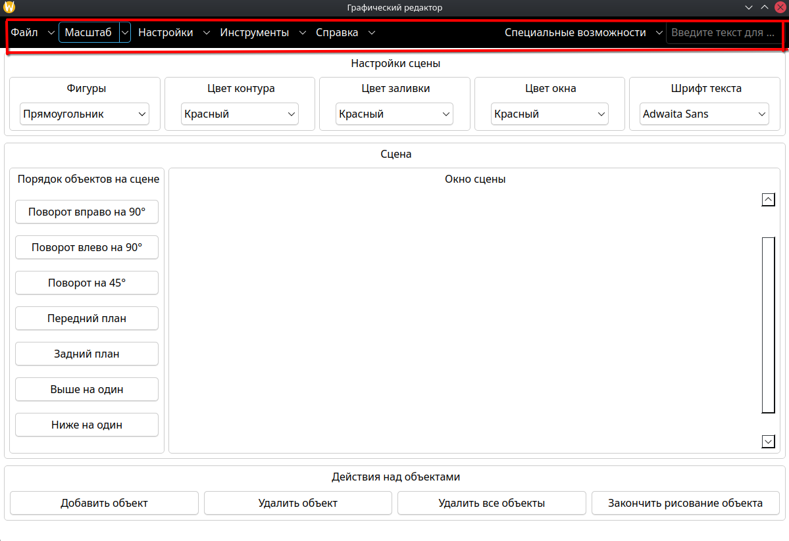

# Панель окна

Панель окна — это верхняя часть приложения **GraphicsEditor**, которая содержит строку меню, поле поиска и группу кнопок быстрого доступа к действиям. Через панель окна пользователь управляет файлами, настройками сцены, инструментами рисования, масштабом и специальными возможностями приложения.

Панель окна состоит из следующих элементов:

- **Строка меню** — выпадающие меню с действиями.
- **Поле поиска** — текстовое поле для быстрого поиска и запуска действий по названию.
- **Меню «Специальные возможности»** — вынесено отдельно в правую часть панели.

Ниже описано каждое меню и все действия внутри него.

---

## 1. Меню «Файл»

Меню **Файл** отвечает за работу с файлами: создание, открытие, сохранение, экспорт и импорт изображений.

Содержит следующие пункты:

### 1.1. Создать

Подменю **Создать** позволяет создать новый файл изображения в одном из поддерживаемых форматов. При выборе формата открывается диалоговое окно, в котором можно задать параметры создаваемого файла (размер, разрешение, цвет фона).

Поддерживаемые форматы:

- **PNG** — растровое изображение с поддержкой прозрачности.
- **JPEG / JPG** — растровое изображение со сжатием.
- **BMP** — растровое изображение без сжатия.
- **SVG** — векторная графика

После подтверждения создаётся файл с заданными параметрами, а пользователю выводится сообщение об успехе или ошибке в строке состояния.

### 1.2. Открыть

Пункт **Открыть** открывает диалоговое окно для выбора файла изображения на диске. После выбора файл загружается на графическую сцену. Если на сцене уже были объекты, они удаляются.

### 1.3. Сохранить

Пункт **Сохранить** открывает диалоговое окно для сохранения текущей сцены в файл изображения. Можно выбрать формат, имя файла и директорию.

### 1.4. Экспорт в PDF

Подменю **Экспорт в PDF** позволяет выгрузить текущую сцену в PDF-документ. Можно выбрать размер страницы (800x600, 1000x700, 1280x720, 1920x1080). Открывается диалог экспорта, в котором задаются параметры и подтверждается сохранение.

### 1.5. Импорт из PDF

Пункт **Импорт из PDF** позволяет загрузить изображение из PDF-документа на сцену. Открывается диалог выбора файла и параметров импорта.

---

## 2. Меню «Масштаб»

Меню **Масштаб** управляет масштабом отображения графической сцены и размером шрифта интерфейса.

Содержит следующие подменю:

### 2.1. Масштаб сцены

Подменю **Масштаб сцены** изменяет масштаб отображения сцены в окне просмотра:

- **Увеличить** — увеличивает масштаб сцены на 20%.
- **Уменьшить** — уменьшает масштаб сцены на 20%.
- **Сбросить** — возвращает исходный масштаб (100%).

Масштаб применяется только к отображению, а не к самим объектам сцены.

### 2.2. Масштаб текста

Подменю **Масштаб текста** изменяет размер текста всего интерфейса приложения:

- **Увеличить** — увеличивает размер шрифта на 2 пункта.
- **Уменьшить** — уменьшает размер шрифта на 2 пункта (минимум 2 пункта).
- **Сбросить** — возвращает исходный размер шрифта.

Изменение применяется ко всем виджетам приложения: меню, кнопкам, полям ввода, диалогам.

---

## 3. Меню «Настройки»

Меню **Настройки** отвечает за внешний вид приложения и настройку шрифта интерфейса.

Содержит следующие пункты:

### 3.1. Вид приложения

Подменю **Вид приложения** позволяет выбрать стиль оформления интерфейса (Qt Style). Доступные стили зависят от окружения пользователя на его операционной системе:

- **Fusion** — нейтральный кроссплатформенный стиль.
- **Windows** — стиль, имитирующий Windows.
- **GTK** — стиль, соответствующий теме GTK из окружения GNOME.
- **Breeze** — стиль KDE Plasma.

При выборе стиль применяется ко всему приложению сразу.

### 3.2. Оформление окна

Подменю **Оформление окна** позволяет выбрать цветовую схему для панели инструментов и всего окна. Каждая тема задаёт пару цветов: для панели инструментов и для окна.

При выборе темы:

- Меняется фон и цвет текста панели инструментов.
- Меняется фон и цвет текста основного окна.
- Стиль поисковой строки тоже обновляется.

Доступны следующие темы:

- Темная тема
- Светлая тема
- Темно-светлая тема
- Светло-темная тема

### 3.3. Настройка шрифта

Пункт **Настройка шрифта** открывает диалоговое окно выбора шрифта интерфейса. Можно выбрать семейство шрифта, размер, начертание (жирный, курсив) и применить ко всему приложению.

### 3.4. Возврат по умолчанию

Пункт **Возврат по умолчанию** сбрасывает все настройки внешнего вида к исходным:

- Панель инструментов снова становится чёрной с белым текстом.
- Окно становится белым с чёрным текстом.
- Шрифт возвращается к исходному.

---

## 4. Меню «Инструменты»

Меню **Инструменты** управляет инструментами рисования и настройками отображения сцены.

Содержит следующие подменю:

### 4.1. Сетка

Подменю **Сетка** управляет отображением и размером сетки на сцене:

- **5×5**, **10×10**, **20×20**, **50×50** — установить размер ячейки сетки в пикселях.
- **Сбросить сетку** — скрыть сетку.

Сетка помогает выравнивать объекты при рисовании.

### 4.2. Контур

Подменю **Контур** управляет стилем обводки объектов на сцене. Содержит три подменю:

#### 4.2.1. Стили линий

Подменю **Стили линий** задаёт стиль линии обводки:

- **Сплошная** — непрерывная линия.
- **Штриховая** — линия из штрихов.
- **Точечная** — линия из точек.
- **Штрихпунктирная** — комбинация штриха и точки.

#### 4.2.2. Стили концов

Подменю **Стили концов** задаёт стиль концов линии:

- **Плоский** — линия обрезается на конце.
- **Квадратный** — линия продлевается на половину толщины.
- **Круглый** — на конце рисуется полукруг.

#### 4.2.3. Стили соединений

Подменю **Стили соединений** задаёт стиль соединения сегментов линии в углах:

- **Скошенный** — угол срезается.
- **Прямой** — угол продлевается до пересечения.
- **Круглый** — угол сглаживается дугой.

#### 4.2.4. Сбросить контур

Пункт **Сбросить контур** возвращает стиль обводки всех объектов к настройкам по умолчанию: сплошная линия, квадратные концы, скошенные соединения.

### 4.3. Заливка

Подменю **Заливка** управляет стилем заливки объектов.

#### 4.3.1. Стили

Подменю **Стили** задаёт шаблон заливки:

- **Сплошная** — заливка одним цветом.
- **Горизонтальная**, **Вертикальная**, **Диагональная** — штриховка.
- **Сетка**, **Крест** — узорчатая заливка.
- **Градиент** — плавный переход цвета.

#### 4.3.2. Сбросить заливку

Пункт **Сбросить заливку** возвращает заливку всех объектов к сплошному цвету.

---

## 5. Меню «Справка»

Меню **Справка** содержит информацию о приложении и ссылки на документацию.

Содержит следующие пункты:

### 5.1. Документация на GitHub

Кнопка **Документация на GitHub** открывает страницу с документацией проекта. При наведении открывается подменю со ссылками на конкретные разделы:

- **Панель окна** — описание меню и панели инструментов.
- **Графическая сцена** — описание работы со сценой.
- **Действия над объектами на сцене** — описание операций над графическими объектами.

**Важно:** в Docker-варианте приложения эта кнопка недоступна, потому что контейнер изолирован от браузера. В этом случае при клике выводится диалог со ссылкой, которую можно скопировать вручную.

### 5.2. О программе

Пункт **О программе** открывает диалоговое окно с информацией о технологиях, использованных в приложении:

- Язык программирования: C++17.
- Фреймворк: Qt 6.11.2.

---

## 6. Меню «Специальные возможности»

Меню **Специальные возможности** управляет режимами, повышающими удобство работы для пользователей с ограниченными возможностями.

Содержит следующие пункты:

### 6.1. Режим просмотра

Пункт **Режим просмотра** включает и выключает режим просмотра. В этом режиме:

- Объекты сцены нельзя перемещать и рисовать новые.
- Кнопки и комбобоксы, связанные с рисованием, отключаются (имеют серый фон с белым текстом).
- Инструменты рисования становятся недоступными.

Это позволяет безопасно просматривать изображение без риска случайного изменения.

### 6.2. Панорамирование сцены

Пункт **Панорамирование сцены** переключает режим перетаскивания сцены. Когда режим включён, сцену можно двигать мышью, как в графических редакторах. Когда выключен — мышь используется для выделения объектов.

### 6.3. Звуковые уведомления

Пункт **Звуковые уведомления** включает и выключает звуковые сигналы при выполнении действий. Когда включено, при открытии диалогов, сохранении и других операциях воспроизводится короткий системный звук.

---

## 7. Поле поиска

Поле поиска расположено в правой части панели инструментов. Оно предназначено для быстрого поиска и запуска действий приложения по названию.

### 7.1. Как работает поиск

1. Пользователь начинает вводить текст в поле.
2. Приложение ищет совпадения среди всех действий меню (включая вложенные подменю).
3. Под полем появляется выпадающий список с найденными действиями.
4. При выборе действия из списка оно **запускается автоматически** — как если бы пользователь выбрал его в меню.

### 7.2. Особенности

- Поиск **не чувствителен к регистру** — «сохранить» и «Сохранить» найдут одно и то же.
- Поиск ищет **по подстроке** — достаточно ввести часть названия.
- После запуска действия поле поиска **очищается**.

---

## 8. Строка состояния

Строка состояния расположена в нижней части окна. Она не является частью панели инструментов, но связана с ней: многие действия выводят в неё сообщения о результате.

Строка состояния показывает:

- Результат выполнения действий (успех, ошибка, отмена).
- Подсказки при наведении на элементы интерфейса.

Сообщения автоматически исчезают через 5 секунд.
